# UML Diagrams Overview

UML (Unified Modeling Language) defines 14 diagram types, split into **structural** (static) and **behavioral** (dynamic).

## Most Important

The five most used in practice:

1. Class
2. Use Case
3. Sequence
4. Activity
5. State Machine

## Structural Diagrams

### Class Diagram

- Importance: High
- Usage:
  - Model classes, attributes, and methods
  - Define relationships (inheritance, association)
  - Blueprint for object-oriented code
- References:
  - [Visual Paradigm – Class Diagram](https://www.visual-paradigm.com/guide/uml-unified-modeling-language/what-is-class-diagram/)
  - [GeeksforGeeks – UML Class Diagrams](https://www.geeksforgeeks.org/unified-modeling-language-uml-class-diagrams/)

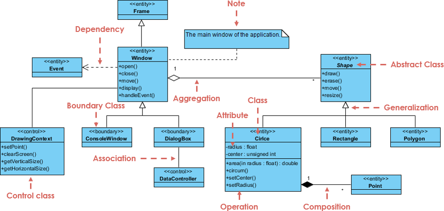

### Component Diagram

- Importance: Medium
- Usage:
  - Show software components and interfaces
  - Map dependencies between modules
  - Document system architecture
- References:
  - [Visual Paradigm – Component Diagram](https://www.visual-paradigm.com/guide/uml-unified-modeling-language/what-is-component-diagram/)
  - [Lucidchart – UML Component Diagram](https://www.lucidchart.com/pages/uml-component-diagram)

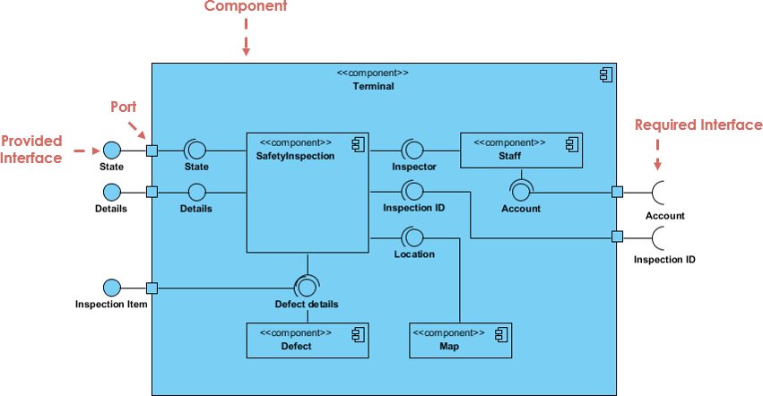

### Deployment Diagram

- Importance: Medium
- Usage:
  - Map artifacts to physical nodes
  - Show hardware and network topology
  - Plan infrastructure deployment
- References:
  - [Visual Paradigm – Deployment Diagram](https://www.visual-paradigm.com/guide/uml-unified-modeling-language/what-is-deployment-diagram/)
  - [Lucidchart – UML Deployment Diagram](https://www.lucidchart.com/pages/uml-deployment-diagram)

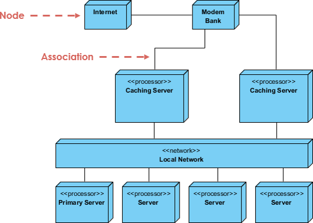

### Package Diagram

- Importance: Medium
- Usage:
  - Group elements into modules
  - Show package dependencies
  - Organize large models
- References:
  - [Visual Paradigm – Package Diagram](https://www.visual-paradigm.com/guide/uml-unified-modeling-language/what-is-package-diagram/)
  - [Lucidchart – UML Package Diagram](https://www.lucidchart.com/pages/uml-package-diagram)

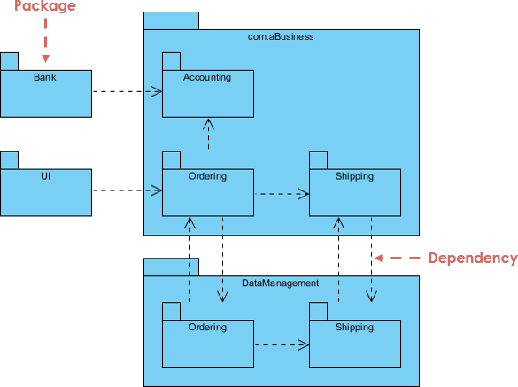

### Object Diagram

- Importance: Low
- Usage:
  - Snapshot instances at a moment
  - Show concrete attribute values
  - Validate class diagram design
- References:
  - [Visual Paradigm – Object Diagram](https://www.visual-paradigm.com/guide/uml-unified-modeling-language/what-is-object-diagram/)
  - [GeeksforGeeks – Object Diagrams](https://www.geeksforgeeks.org/unified-modeling-language-uml-object-diagrams/)

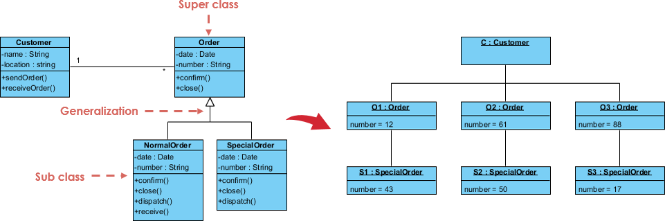

### Composite Structure Diagram

- Importance: Low
- Usage:
  - Show internal parts of a class
  - Model ports and connectors
  - Describe runtime collaborations
- References:
  - [Visual Paradigm – Composite Structure Diagram](https://www.visual-paradigm.com/guide/uml-unified-modeling-language/what-is-composite-structure-diagram/)
  - [UML-Diagrams.org – Composite Structure Diagrams](https://www.uml-diagrams.org/composite-structure-diagrams.html)

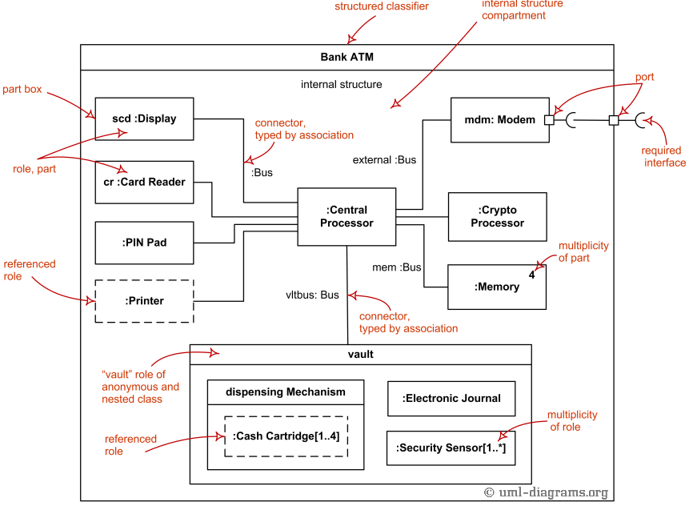

### Profile Diagram

- Importance: Low
- Usage:
  - Extend UML with stereotypes
  - Add domain-specific tagged values
  - Customize UML for a platform
- References:
  - [Visual Paradigm – Profile Diagram](https://www.visual-paradigm.com/guide/uml-unified-modeling-language/what-is-profile-diagram/)
  - [UML-Diagrams.org – Profile Diagrams](https://www.uml-diagrams.org/profile-diagrams.html)

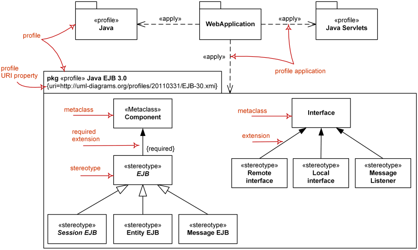

## Behavioral Diagrams

### Use Case Diagram

- Importance: High
- Usage:
  - Capture functional requirements
  - Show actors and their goals
  - Define system scope
- References:
  - [Visual Paradigm – Use Case Diagram](https://www.visual-paradigm.com/guide/uml-unified-modeling-language/what-is-use-case-diagram/)
  - [GeeksforGeeks – Use Case Diagrams](https://www.geeksforgeeks.org/use-case-diagram/)

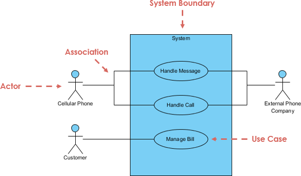

### Sequence Diagram

- Importance: High
- Usage:
  - Show message exchange over time
  - Model object interactions
  - Detail a single scenario flow
- References:
  - [Visual Paradigm – Sequence Diagram](https://www.visual-paradigm.com/guide/uml-unified-modeling-language/what-is-sequence-diagram/)
  - [GeeksforGeeks – Sequence Diagrams](https://www.geeksforgeeks.org/unified-modeling-language-uml-sequence-diagrams/)

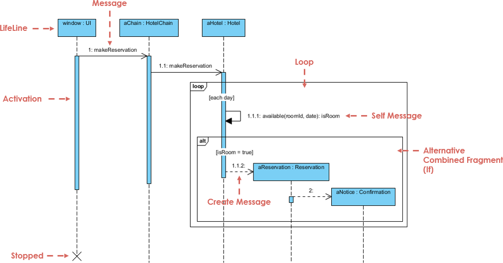

### Activity Diagram

- Importance: High
- Usage:
  - Model workflows and processes
  - Show control and decision flow
  - Represent parallel activities
- References:
  - [Visual Paradigm – Activity Diagram](https://www.visual-paradigm.com/guide/uml-unified-modeling-language/what-is-activity-diagram/)
  - [Lucidchart – UML Activity Diagram](https://www.lucidchart.com/pages/uml-activity-diagram)

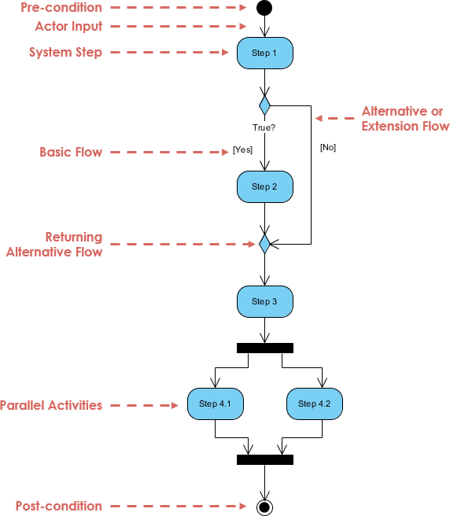

### State Machine Diagram

- Importance: High
- Usage:
  - Model object lifecycle states
  - Define transitions and triggers
  - Handle event-driven behavior
- References:
  - [Visual Paradigm – State Machine Diagram](https://www.visual-paradigm.com/guide/uml-unified-modeling-language/what-is-state-machine-diagram/)
  - [Lucidchart – UML State Machine Diagram](https://www.lucidchart.com/pages/uml-state-machine-diagram)

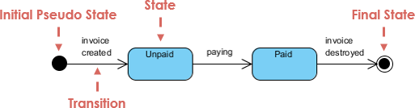

### Communication Diagram

- Importance: Low
- Usage:
  - Show interactions via object links
  - Emphasize structural relationships
  - Alternative to sequence diagrams
- References:
  - [Visual Paradigm – Communication Diagram](https://www.visual-paradigm.com/guide/uml-unified-modeling-language/what-is-communication-diagram/)
  - [UML-Diagrams.org – Communication Diagrams](https://www.uml-diagrams.org/communication-diagrams.html)

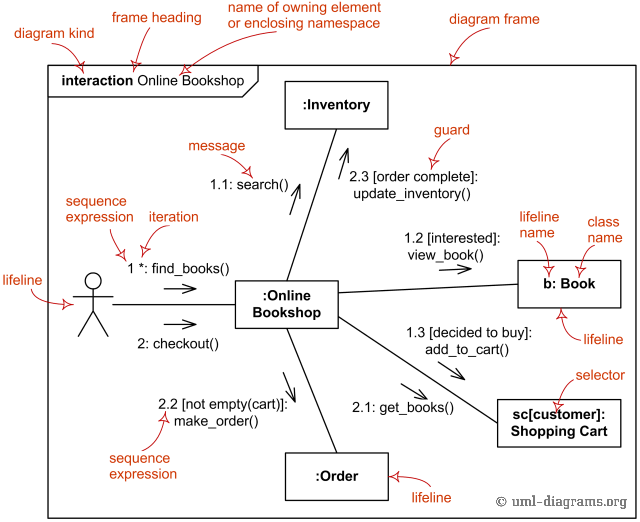

### Timing Diagram

- Importance: Low
- Usage:
  - Show state changes over time
  - Model timing constraints
  - Analyze real-time behavior
- References:
  - [Visual Paradigm – Timing Diagram](https://www.visual-paradigm.com/guide/uml-unified-modeling-language/what-is-timing-diagram/)
  - [UML-Diagrams.org – Timing Diagrams](https://www.uml-diagrams.org/timing-diagrams.html)

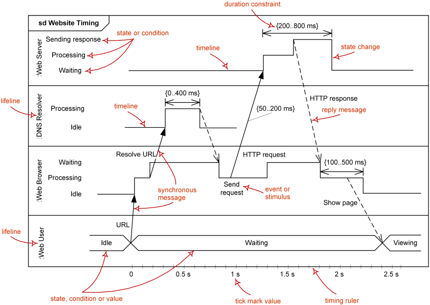

### Interaction Overview Diagram

- Importance: Low
- Usage:
  - Combine activity and sequence views
  - Show high-level control flow
  - Link multiple interactions
- References:
  - [Visual Paradigm – Interaction Overview Diagram](https://www.visual-paradigm.com/guide/uml-unified-modeling-language/what-is-interaction-overview-diagram/)
  - [UML-Diagrams.org – Interaction Overview Diagrams](https://www.uml-diagrams.org/interaction-overview-diagrams.html)

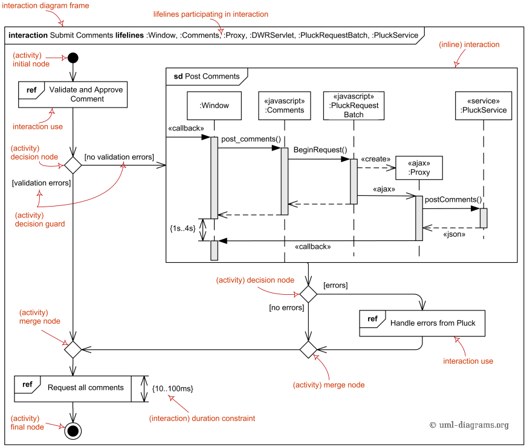

