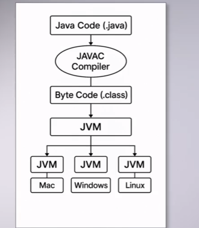

# Java Fundamentals

### References
- https://www.w3schools.com/java/java_ref_reference.asp

---

## Setup
*Development environment and tools*

**JDK (Java Development Kit)** – Complete development environment (compiler, libraries, tools)
**IDE** – IntelliJ IDEA
**Plugin** – SonarQube (code quality)

### Architecture
*How Java executes your code*

```
JDK = JRE + Development Tools
JRE = JVM + Runtime Libraries
```

**JVM (Java Virtual Machine)**
Executes bytecode (`.class` files) and translates it into machine-specific instructions. Acts as an abstraction layer between Java code and the operating system, enabling platform independence.

**JRE (Java Runtime Environment)**
Provides everything needed to run Java applications. Includes the JVM plus standard libraries (like `java.lang`, `java.util`). End users only need JRE to run programs.

**JDK (Java Development Kit)**
Complete toolkit for developers. Contains JRE plus development tools like:
- `javac` (compiler: `.java` → `.class`)
- `javadoc` (documentation generator)
- `jar` (archive tool)
- Debugger and other utilities

**Write once, run anywhere** – Java compiles to platform-independent bytecode



---

## Naming Conventions
*Standard rules for naming in Java*

### Packages
```java
com.company.project          // ✓ correct
com.mycompany.myapp.utils    // ✓ correct
MyPackage                    // ✗ wrong (uppercase)
```

### Classes – PascalCase
```java
class Car                    // ✓ correct
class UserAccount            // ✓ correct
class car                    // ✗ wrong (lowercase)
```

### Variables – camelCase
```java
int age;                     // ✓ correct
String firstName;            // ✓ correct
int Age;                     // ✗ wrong (uppercase start)
```

### Constants – UPPER_SNAKE_CASE
```java
static final int MAX_SIZE = 100;           // ✓ correct
static final String API_KEY = "abc123";    // ✓ correct
```

### Methods – camelCase (verbs)
```java
void calculateTotal()        // ✓ correct
String getName()             // ✓ correct
```

### Boolean Variables – is/has/can/should prefix
```java
boolean isActive;            // ✓ correct
boolean hasPermission;       // ✓ correct
boolean canEdit;             // ✓ correct
```

### Summary Table

| Element    | Convention       | Example              |
|------------|------------------|----------------------|
| Package    | lowercase        | `com.company.app`    |
| Class      | PascalCase       | `UserAccount`        |
| Variable   | camelCase        | `firstName`          |
| Constant   | UPPER_SNAKE_CASE | `MAX_SIZE`           |
| Method     | camelCase        | `calculateTotal()`   |
| Boolean    | is/has/can       | `isActive`           |

---

## Data Types
*Variables and their value types*

```java
// Primitives
int n;           // integer
double d;        // decimal
boolean b;       // true/false
char c;          // single character
long l;          // large integer
float f;         // less precise decimal
short s;         // small integer
byte bt;         // tiny integer

// Reference types
String text;     // text
LocalDate date;  // date
int[] arr;       // array
Object obj;      // generic object
```

### Type Conversion
```java
// Implicit (widening)
int x = 10;
double y = x;    // int → double

// Explicit (narrowing)
double z = 9.78;
int w = (int) z; // double → int (loses decimal)
```

---

## Input
*Reading user data from console*

```java
Scanner sc = new Scanner(System.in);
String name = sc.nextLine();    // text
int age = sc.nextInt();         // number
sc.close();
```

---

## Memory Model
*How Java stores data in memory*

**Stack** – Stores primitives and references (limited size)
**Heap** – Stores objects (dynamic, managed by GC)

Primitives are stored directly in the stack, while objects are stored in the heap and their references in the stack.

```java
// Primitives: copy value
int a = 10;
int b = a;      // b is independent copy

// Objects: copy reference
String s1 = new String("Hi");
String s2 = s1; // both point to same object
s1 = null;      // s2 still exists
```

---

## Entry Point
*Where your program begins*

```java
public class Main {
    public static void main(String[] args) {
        // Program starts here
    }
}
```

Only code inside `main()` runs automatically. Other methods and classes execute when called from `main()`.
